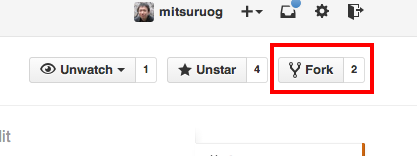
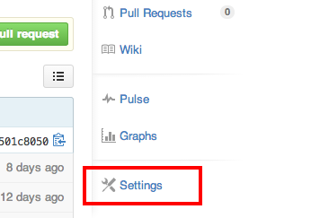

# 1. 準備

### リポジトリのコピー

まず、このリポジトリをコピーします。Github上であたなのリポジトリへ`Fork`してください。  
Forkした後にリポジトリ名を`x-あなたの名前(x-mitsuruogなど)`に変更します。リポジトリ名はGithub上の`Settings`から変える事ができます。

Fork：



Settings：



Forkした後は、ローカルPC上の作業用のフォルダにリポジトリをCloneします。

````
cd 作業フォルダの直上のフォルダ
git clone https://github.com/<あなたのアカウント名>/<あなたのリポジトリ名>.git
cd <あなたのリポジトリ名>
````

### 動作確認

リポジトリのCloneが完了したら、npmモジュールをインストールします。

```
npm install
```

簡易Webサーバを立ち上げます。

```
grunt serve
```

ブラウザで以下のURLを開きます。えんぷら部のWeb名刺が表示されたらひとまずOKです。  
<http://localhost:8000>


### ディレクトリ構成

ディレクトリ構成は以下の通りです。ハンズオンでは`index.html`と`x-yourename.html`を使います。

```
..
├── ./001_pre          // ハンズオン用資料
├── ./002_hello_world  // ハンズオン用資料
├── ./003_create_card  // ハンズオン用資料
├── ./004_decoration   // ハンズオン用資料
├── ./005_exchange     // ハンズオン用資料
├── ./node_modules
├── ./Gruntfile.js
├── ./index.html        // テスト用ページ
├── ./x-yourename.html  // Web名刺用のWeb Components
├── ./package.json
└── ./README.md
```

----
[:point_right: 2. Web ComponentsでHello World](../002_hello_world)
