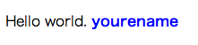

# 2. Web Componentsで「Hellow World」

### index.htmlを作成

Web Componentsを確認するために次のようなindex.htmlを作成します。  
既にファイルが存在する場合は、中身を置き換えてください。

```html
<!-- index.html -->

<!DOCTYPE html>
<html>
    <head>
        <meta http-equiv="content-type" content="text/html; charset=utf-8" />
        <title>Web Components study</title>
    </head>        
    <style>
        .name {
            color: red;
        }
    </style>
    <body>
    
    </body>
</html>

```

### Custom Elementsを作成する

まずはじめにCustom Elementsを作成します。`x−yourname.html`を作成して、内部を以下のように変更してください。  `<template>`の内部にはCustom Elementsの内部構造やスタイルが格納されます。`<script>`内部にはCustom Elements内部にプロパティやメソッドなど、外部に公開するためのAPIを定義することができます。

> :gift_heart: カスタム要素名は「`-(ハイフン)`」を含めるなければなりません。

> :gift_heart: `<script>`のパートはグローバルスコープで動作するため、即時関数でスコープを形成しています。

> :gift_heart: Custom Elementsの詳細についてはこちらを参照ください。[Custom Elements: HTML に新しい要素を定義する - HTML5 Rocks](http://www.html5rocks.com/ja/tutorials/webcomponents/customelements/)


```html
<!-- x−yourname.html -->

<template>

  <style>
    .name {
      color: blue;
      font-weight: bold;
    }
  </style>

  <p>Hello world. <span class="name">yourename</span></p>

</template>

<script>
(function(window, document) {    
  
  // HTMLElementを継承します
  var elementProto = Object.create(HTMLElement.prototype);
    
  // カスタム要素を登録
  document.registerElement('x-yourename', {
    prototype: elementProto
  });

})(window, document);
</script>

```

### index.htmlにHTML Importsする

Custom Elementsを`index.html`にインポートします。`index.html`の`<head>`にimport文を追加してください。 
これによりCustom Elementsをページ内で利用するためのリソースを一度に読み込むことができます。

> :gift_heart: HTML Importsについての詳細はこちらを参照してください。[HTML Imports: ウェブのための #include - HTML5 Rocks](http://www.html5rocks.com/ja/tutorials/webcomponents/imports/)

```html
<!-- index.html -->

<!DOCTYPE html>
<html>
    <head>
        <meta http-equiv="content-type" content="text/html; charset=utf-8" />
        <title>Web Components study</title>
        <link rel="import" href="x-yourname.html" />
    </head>
    <style>
        ...
        
</html>

```

> :gift_heart: 以下の様にすることで、importに関する任意のイベントをハンドルすることができます。ただし、ハンドルする関数はimport文の前で定義してください。
```html
<link rel="import" href="x-yourname.html" 
    onload="handleLoad(event)" onerror="handleError(event)">
```

### Custom ElementsのShadow DOM化

Custom Elementsをimportしただけではまだ内部構造を`カプセル化`できていません。内部構造を隠蔽するためにはCustom ElementsをShadow DOM化することが必要です。  
`x−yourname.html`の内部を以下のように変更してください。この例では、この要素がインスタンス化された場合にShadowDOM化されるようにしています。

```html
<!-- x−yourname.html -->

<template>
  ...
</template>

<script>
(function(window, document) {

  // HTMLElementを継承します
  var elementProto = Object.create(HTMLElement.prototype);

  // Components側のdocument
  var doc = document.currentScript.ownerDocument;

  // template
  var template = doc.querySelector('template').content;

  // インスタンス化した場合の処理
  elementProto.createdCallback = function() {
    // templateをDeepcloneします。
    var shadowDom = template.cloneNode(true);
    
    // ShadowRootを作成して、その配下にNodeを追加します。
    var shadowRoot = this.createShadowRoot();
    shadowRoot.appendChild(shadowDom);
  };

  // カスタム要素を登録
  document.registerElement('x-mitsuruog', {
    prototype: elementProto
  });
  
})(window, document);
</script>

```
> :gift_heart: `createdCallback`は`ライフサイクルコールバックメソッド`と呼ばれるもので、Custom Elementsのライフサイクルに応じて発生するイベントをハンドルすることができます。他にも次のようなものがあります。
* **createdCallback**: 要素のインスタンスが作られた時
* **attachedCallback**: インスタンスがドキュメントに追加された時
* **detachedCallback**: インスタンスがドキュメントから取り除かれた時
* **attributeChangedCallback(attrName, oldVal, newVal)**: 属性が追加、削除、更新された時

> :gift_heart: Custom Elementsのライフサイクルについての詳細はこちらを参照してください。[Custom Elements: HTML に新しい要素を定義する - HTML5 Rocks](http://www.html5rocks.com/ja/tutorials/webcomponents/customelements/)

### インスタンス化

最後にCustom Elementsをインスタンス化します。`index.html`の`<body>`の中で、新しい要素`<x-yourname>`を呼び出します。
このタイミングで、Custom Elements内部の`createdCallback`が呼び出され、Custom Elementsの内部が`Shadow DOM化`されます。

```html
<!-- index.html -->

<!DOCTYPE html>
<html>
    <head>
        <meta http-equiv="content-type" content="text/html; charset=utf-8" />
        <title>Web Components study</title>
        <link rel="import" href="x-yourname.html" />
    </head>
    <body>
      <!-- ここでCustom Elementsをインスタンス化 -->
      <x-yourname></x-yourname>
    </body>
</html>

```

> :gift_heart: 次のようにJavascriptにてインスタンス化する方法もあります。  
DOMを直接生成する
```javascript
var xYourname = document.createElement('x-yourname');
```
newで生成する
```javascript
var xYourname = new XYourname();
```

これで<http://localhost:8000>をブラウザで開くとHelloWorldメッセージが表示されます。  
「yourename」の`.name`のスタイルは外部から**red**で指定されていますが、Web Components内部まで影響されず、内部スタイルの**blue**のままであることがわかります。

結果：



----
[:point_right: 3. Web名刺を作成](../003_create_card)

[:point_left: 1. 準備](../001_pre)  
