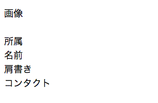

# 3. Web名刺を作成

Web Componentsで「Hellow World」を作ることができたので、ここからはWeb名刺の作成を行います。

### Web名刺の内部構造を作る

まず、Web名刺の内部構造を作ります。`x-yourname.html`の`<template>`を以下のように変更します。

```html
<!-- x−yourname.html -->

<template>

  <style>
  </style>

  <article class="me">
    <dl class="me-profile">
    
      <dt>画像</dt>
      <dd class="me-image">
        </img>
      </dd>

      <dt>所属</dt>
      <dd class="me-company"></dd>

      <dt>名前</dt>
      <dd class="me-name"></dd>

      <dt>肩書き</dt>
      <dd class="me-title"></dd>

      <dt>コンタクト</dt>
      <a href="" class="me-contact-url">
        <dd class="me-contact"></dd>
      </a>
      
    </dl>
  </article>
  
</template>

<script>
  ...
  
```

結果：



> :gift_heart: Templateについての詳細はこちらを参照してください。[HTML で利用可能になった Template タグ: クライアントサイドのテンプレートの標準化 - HTML5 Rocks](http://www.html5rocks.com/ja/tutorials/webcomponents/template/)

### プロフィールの紐付け

このWeb名刺のカスタム要素が`<x-yourname>`が、プロフィールを内部構造に紐づける処理を追加します。
`x-yourname.html`の`<script>`内に`attachedCallback`を追加します。

```html
<!-- x−yourname.html -->

<template>
  ...
</template>

<script>

  ...
  
  // あなたのプロフィール
  var me = {
    img: "https://avatars1.githubusercontent.com/u/4105415",
    name: "えんぷら部",
    company: "html5jエンタープライズ部",
    title: "オープンコミュニティ",
    contact: "#html5biz",
    contactUrl: "http://www.html5biz.org/"
  };
  
  // インスタンス化した場合の処理
  elementProto.createdCallback = function() {
    ...
  }
  
  // elementがdocumentに追加された場合の処理
  elementProto.attachedCallback = function() {
    // ShadowDOM化した内部から所定の要素を検索してプロフィールを設定する。
    var shadowRoot = this.shadowRoot;
    shadowRoot.querySelector('.me-image img').src = me.img;
    shadowRoot.querySelector('.me-name').textContent = me.name;
    shadowRoot.querySelector('.me-company').textContent = me.company;
    shadowRoot.querySelector('.me-title').textContent = me.title;
    shadowRoot.querySelector('.me-contact').textContent = me.contact;
    shadowRoot.querySelector('.me-contact-url').href = me.contactUrl;
  };
  
  ...

</script>

```
結果：


> :gift_heart: Shadow DOMの内部構造についての詳細はこちらを参照してください。[Shadow DOM 301: 上級者向けコンセプトと DOM API - HTML5 Rocks](http://www.html5rocks.com/ja/tutorials/webcomponents/shadowdom-301/)

----
[:point_right: 4. Web名刺をデコレーション](../004_decoration)

[:point_left: 2. Web ComponentsでHello World](../002_hello_world)  

