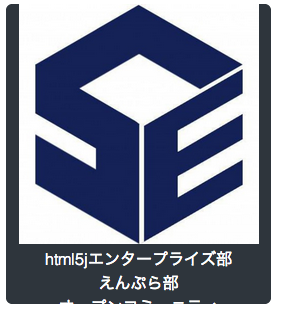
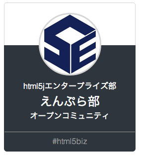
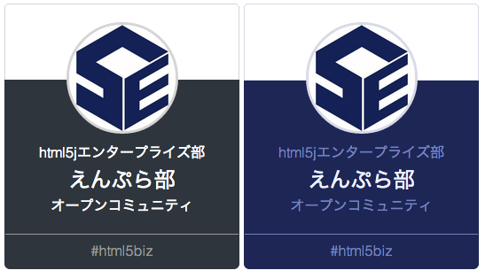

# 4. Web名刺をデコレーション

Web名刺の内部構造が出来ましたので、スタイルを追加して装飾していきます。

### Web名刺を装飾

Web名刺を順番に装飾していきます。`x-yourname.html`の`<style>`にスタイルを追加していきます。Web名刺のスタイルの内部構造は`.me`をルートとしたモジュールを形成しています。まず、`.me`モジュールのベーススタイルを定義していきます。


```html
<!-- x−yourname.html -->

<template>
  <style>
    :host {
      display: inline-block;
    }
    
    /* module
    ================================== */
    .me {
        font-family: 'Helvetica', Arial, sans-serif;
        font-weight: 100;
    
        position: relative;
    
        display: inline-block;
        overflow: hidden;
    
        width: 265px;
        height: 300px;
    
        text-align: center;
    
        color: #fff;
        border-radius: 6px;
        background-color: #2e353c;
    }
    .me dt {
      display: none;
    }
    .me dd,
    .me dl {
      margin: 0;
    }

  </style>
</template>

...

```
結果：



次に、`.me`モジュール内部のサブモジュールを装飾していきます。


```html
<!-- x−yourname.html -->

<template>
  <style>
  
    /* module
    ================================== */
    ...
    
    /* sub module
    ================================== */
    .me-profile {
        height: 85px;
    
        border: 1px solid #d5d5d5;
        border-bottom: 0;
        background: #fff;
    }
    
    dd.me-image {
        display: inline-block;
    
        margin: 20px 0 10px;
    }
    .me-image img {
        width: 120px;
        height: 120px;
    
        vertical-align: middle;
    
        border: 3px solid #d5d5d5;
        border-radius: 100%;
        background: #fff;
    }
    
    .me-name {
        font-size: 24px;
    }
    
    .me-contact {
        position: relative;
        top: 19px;
    
        padding: 10px;
    
        color: #999;
        border-top: 1px solid #999;
    }
    a.me-contact-url {
        text-decoration: none;
    }
    
  </style>
</template>

...

```

結果：



### テーマを追加

Web名刺内部にテーマを持ち、外部から指定できるようにします。スタイルに`:host(<セレクタ>)`を定義することで、セレクタとマッチする`<x-yourename>`に対して、所定のテーマを設定することができます。  
今回は`.enpura`テーマとします。

> :gift_heart: `:host`はCustom Elements(ホスト要素)に対してのスタイル指定です。それに対し`:host-context`はホスト要素を遡ってスタイルの指定を行うことが出来ます。例えば`<body>`にスタイルを指定する方法です。


```html
<!-- x−yourname.html -->

<template>
  <style>
  
    /* module
    ================================== */
    ...
    
    /* sub module
    ================================== */
    ...
    
    /* thema
    ================================== */
    :host(.enpura) .me {
        color: #eef1fd;
        background-color: #1d2654;
    }
    
    :host(.enpura) .me-profile {
        border: 1px solid #d8dbe7;
        background: #fff;
    }
    
    :host(.enpura) .me-image img {
        border: 3px solid #d8dbe7;
    }
    
    :host(.enpura) .me-title,
    :host(.enpura) .me-company,
    :host(.enpura) .me-contact {
        color: #7782bf;
    }
    
    :host(.enpura) .me-contact {
        border-top: 1px solid #7782bf;
    }

  </style>
</template>

...

```

続いて、`index.html`にてテーマ付き`<x-yourname>`を追加します。

```html
<!-- index.html -->

<!DOCTYPE html>
<html>
    <head>
        <meta http-equiv="content-type" content="text/html; charset=utf-8" />
        <title>Web Components study</title>
        <link rel="import" href="x-yourname.html" />
    </head>
    <body>
        <x-yourname></x-yourname>
        <x-yourname class="enpura"></x-yourname>
    </body>
</html>


```

結果：



> :gift_heart: 通常、Shadow DOM内部は`Shadow Boundary`と呼ばれる境界線で隔離されています。`::shadow`や`/deep/`を使う事でShadow Boundaryを破壊して外部からShadow DOM
内部をスタイリングすることができます。

> :gift_heart: Shadow DOM内部のスタイリングについての詳細はこちらを参照してください。[Shadow DOM 201: CSS とスタイリング - HTML5 Rocks](http://www.html5rocks.com/ja/tutorials/webcomponents/shadowdom-201/)

### アニメーションを追加

Web名刺にアニメーションを追加してみましょう。押し心地のいいボタンアニメーションを追加します。

```html
<!-- x−yourname.html -->

<template>
  <style>
  
    /* thema
    ================================== */
    ...
    
    /* animation
    ================================== */
    :host(:active) {
      position: relative;
      top: 7px;
      left: 7px;
    }    
    
  </style>
</template>

...

```

> :gift_heart: 複雑なkeyframeを使ったアニメーションを作成する際は、[CSS3 Keyframes Animation Generator](http://www.cssanimate.com/)のようなジェネレートサービスを利用すると楽です。

これでWeb名刺が完成しました。次はこれを配布します。

----
[:point_right: 5. 配布(名刺交換)](../005_exchange)

[:point_left: 3. Web名刺を作成](../003_create_card)  
