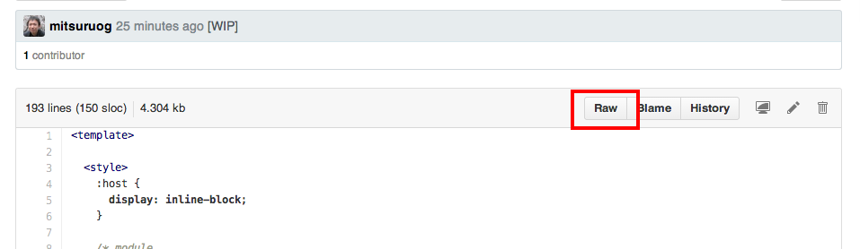

# 5. 配布(名刺交換)

Web名刺ができましたので、配布しましょう。

### GithubリポジトリへPush

ローカルのGitリポジトリに変更内容をCommitして、Github上のリポジトリへPushします。
以下、黒い画面(ターミナルやコマンドプロンプトなど)で実行してください。

```
git status
git add .
git commit -m "Commitメッセージ"
git push origin master
```

> pushがうまく行かない場合はremoteの指定が間違っている可能性があります。
```
# remote確認
git remote -v
# remote追加
git remote add origin https://github.com/<あなたのGithubアカウント名>/<あなたのリポジトリ名>.git
```

これで、Github上のリポジトリにあなたのWeb名刺が登録されました。

### デモページの作成

> :warning: Web名刺のデモページを作成する必要が無い場合は割愛してください。

次にデモページの作成を行います。Githubでは`gh-pages`ブランチを作成することで、内容を外部に公開することが出来ます。  
リポジトリにはgh-pagesに公開するためのgruntタスクが設定されています。

```
grunt deploy
```

> gruntタスクを利用しない場合は、以下のように直接gitコマンドを打ってください。
```
git branch gh-pages
git checkout gh-pages
git push origin gh-pages
git checkout master
```

公開用URLは次の通りです。

```
http://<あなたのGithubアカウント名>.github.io/<あなたのリポジトリ名>
```

### 他の人のWeb名刺を利用する

他の人が作成したWeb名刺を利用するためには、作成したWeb ComponentsをURL指定で**HTML Import**した後に利用する必要があります。
利用したいWeb ComponentsのhtmlファイルのURLを`raw`指定して取得して、下記`rawgit`にてimport可能なURLに変換してください。

<http://rawgit.com/>
> :warning: 大量アクセスがないと思いますので、**Development**のURLを利用してください。**Production**のURLを利用する場合は、CDN上にキャッシュされリフレッシュしないため、commitのハッシュも含めたURLを指定してください。

rawのURLはGuthub上のこちらのボタンから表示できます。



HTML importが完了したら、カスタム要素`<x-someone>`を呼び出せばWeb名刺をあなたのページにて利用できます。

### 最後に

ハンズオンは以上ですが、Web Componentsを作成する場合に参照すると良いページを紹介します。

WebComponents公式  
[WebComponents.org](http://webcomponents.org/)

Googleが提供するWeb Componentsのスタイルガイド  
[GoogleWebComponents/style-guide](https://github.com/GoogleWebComponents/style-guide)

Web Componentsのboilerplate  
[webcomponents/hello-world-element](https://github.com/webcomponents/hello-world-element)

Web Components Best Practices  
[Web Components Best Practices](http://webcomponents.org/articles/web-components-best-practices/)

それでは、これから始まるWeb Components時代をenjoyしてください！  
ではではー。:beers:

----
[:point_left: 4. Web名刺をデコレーション](../004_decoration)  

[@mitsuruog](https://github.com/mitsuruog) :white_flower: 2014
